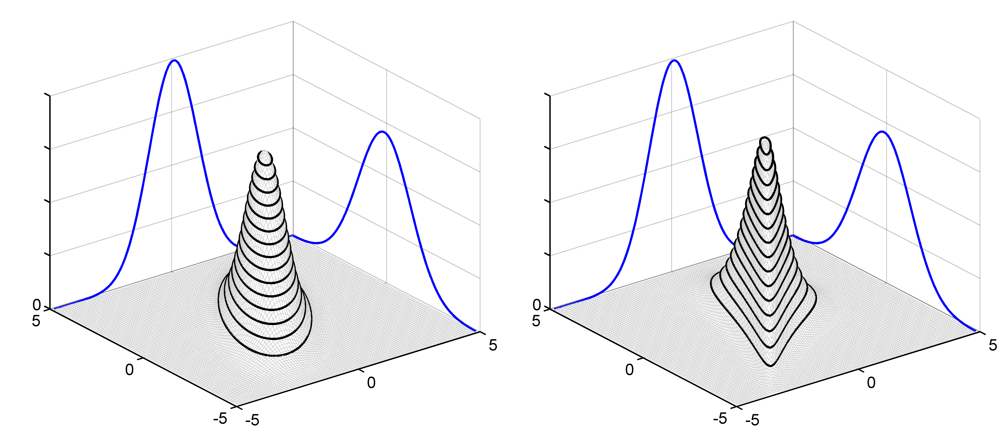
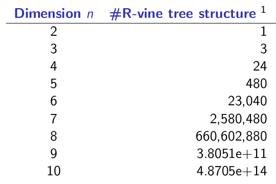

% JRW 2015
%		R-Vines: conditioning sets
% Christian Groll

# Vine copulas: introduction and motivation

## 

**Definition:** Copula

A $d$-dimensional copula $C$ is a multivariate distribution on
$[0,1]^{d}$ with **uniformly distributed** marginals.

## Sklar's theorem [@rv_sklar_1959_fonctions]

Any continuous multivariate distribution can be **decomposed** into a
copula and marginal distributions:

## Sklar's theorem II

Combining any **copula** with any continuous **marginal
distributions** leads to a valid joint distribution:

## Sklar's theorem III

\begin{equation*}
f_{12}(x_{1},x_{2})=c_{12}(F_{1}(x_{1}),F_{2}(x_{2}))f_{1}(x_{1})f_{2}(x_{2})
\end{equation*}

. . .

\begin{align*}
f_{1 \vert 2}(x_{1} \vert  x_{2})&=\frac{f_{12}(x_{1},x_{2})}{f_{2}(x_{2})}\\
&=c_{12}(F_{1}(x_{1}),F_{2}(x_{2}))f_{1}(x_{1})
\end{align*}

## General problem

**Quantity of interest**

\begin{equation*}
\bf{Z}=g(\bf{X}),\quad \bf{X}=(X_{1},\ldots, X_{d})
\end{equation*}

- $X_{i}$ are random variables
- *g* some kind of aggregation

. . .

$\Rightarrow$ both **marginal distributions** and the **dependence**
structure is important

## Copulas: Benefit

- allow fancy dependence structures between $X_{i}$ and $X_{j}$

## Copulas: Main benefit

- allow usage of **arbitrary marginal distributions** $F_{X_{i}}$ in
  joint distribution

## Pair copula construction

Following [@rv_czad_2014_model]:

. . .

- flexible extension to **multi-dimensional** setting

. . .

- using **bivariate copulas** as building blocks for
  higher-dimensional distributions

## 

- based on density decomposition:

\begin{equation*}
f(x_{1}, \ldots, x_{d})=f_{1}(x_{1})\cdot f_{2 \vert 1}(x_{2} \vert  x_{1}) \cdot
	\ldots \cdot f_{d \vert  1\ldots d-1}(x_{d} \vert  x_{1}, \ldots, x_{d-1})
\end{equation*}

. . .

- recursive computation of conditional distributions [@joe96]:

\begin{equation*}
\mathbf{v} \subset\{x_{1},\ldots,x_{d}\},\ x_{i}\not\in \mathbf{v}
\end{equation*}

. . .

\begin{align*}
F(x_{i} \vert \mathbf{v})&=\\
F(x_{i} \vert x_{j}, \mathbf{v}_{-j})&=\frac{\partial C_{ij;\mathbf{v}}\left(F(x_{i} \vert \mathbf{v}_{-j}), F(x_{j} \vert \mathbf{v}_{-j})\right)}
	{\partial F(x_{j} \vert \mathbf{v}_{-j})}\\
	&=h_{ij;\mathbf{v}}\left(F(x_{i} \vert \mathbf{v}_{-j}), F(x_{j} \vert \mathbf{v}_{-j})\right)
\end{align*}

## 

Decompose density such that dependency between variables is defined
exactly once for each pair of variables $(x_{i},x_{j})$:

. . .

- dependency either **unconditionally** specified: 

\begin{equation*}
c_{ij}(F(x_{i}),F(x_{j}))
\end{equation*}

. . .

- or **conditionally**: 

\begin{equation*}
c_{ij;\mathbf{v}}(F(x_{i} \vert \mathbf{v}),F(x_{j} \vert \mathbf{v}))
\end{equation*}

## 

- huge number of possible decompositions [@rv_moral_cook_2010_about]:

##

- vines: graphical structure to organize different density
  decompositions [@rv_bedf_cook_2002_vines]

INCLUDE: pics of vine

## tree selection strategies

- iterative procedure: higher conditional copulas based on estimation
  error of first steps

. . .

$\Rightarrow$ heuristic: capture strong pairwise dependencies first

. . .

$\Rightarrow$ e.g.: maximum spanning tree algorithms

# Copula factor model

## General problem

**Quantity of interest**

\begin{equation*}
\bf{Z}=g(\bf{X}),\quad \bf{X}=(X_{1},\ldots, X_{d})
\end{equation*}

. . .

**Modification**

\begin{equation*}
\bf{Z}=g(\bf{X}),\quad \bf{X}=(X_{1},\ldots, X_{d}, \color{lawngreen}{S_{1},\ldots,S_{d_{S}}})
\end{equation*}

## Idea

- impose additional structure to **reduce estimation error**

. . .

- similar to conventional **factor model**

\begin{equation*}
X_{i}=\alpha_{1}S_{1}+\ldots+\alpha_{d_{S}}S_{d_{S}}+\epsilon_{i}
\end{equation*}

. . .

- links to factors drive joint distribution

\begin{equation*}
\Sigma_{X}=A\Sigma A^{T} + \text{Cov}(\epsilon)
\end{equation*}

. . .

So far: 

- straightforward application of conventional R-Vine model

. . .

- "only" challenge: **find optimal** auxiliary **factors**

## Deviations from conventional approach

. . .

- conventional R-Vine model: **joint unconditional distribution** as
  modeling target

. . .

- no special ordering on variables: variables occur
  **"simultaneously"**

. . .

Now with factor structure:

. . .

- temptation of **conditional modeling** due to interpretable structure 

. . .

- **stress testing**: what if factors are ... ?

. . .

- **incorporating new information**: factors represent persistent
  states

## Possible criticism

- unintuitive, complicated $\Rightarrow$ blackbox approach

. . .

- overfitting

. . .

- simplifying assumption (Spanhel, Kurz)

## References
