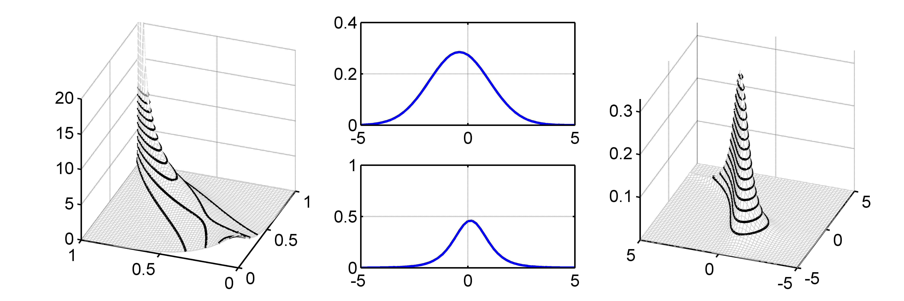
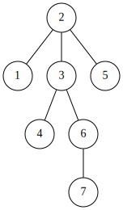
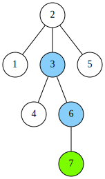
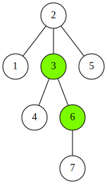
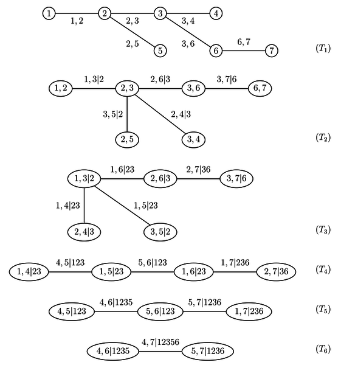
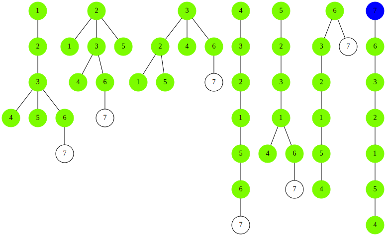

% JRW 2015
%		R-Vines: conditioning sets
% Christian Groll

# Vine copulas: introduction and motivation

## 

**Definition:** Copula

A $d$-dimensional copula $C$ is a multivariate distribution on
$[0,1]^{d}$ with **uniformly distributed** marginals.

<aside class="notes">
- what makes them so useful
</aside>

## Sklar's theorem [@rv_sklar_1959_fonctions]

Any continuous multivariate distribution can be **decomposed** into a
copula and marginal distributions:

<aside class="notes">
- any other probabilistic approach is nested
- more important
</aside>

## Sklar's theorem II

Combining any **copula** with any continuous **marginal
distributions** leads to a valid joint distribution:

<aside class="notes">
- dramatically expands repertoire of distributions
- in formulas
</aside>

## Sklar's theorem III

\begin{equation*}
f_{12}(x_{1},x_{2})=c_{12}(F_{1}(x_{1}),F_{2}(x_{2}))f_{1}(x_{1})f_{2}(x_{2})
\end{equation*}

. . .

\begin{align*}
f_{1 \vert 2}(x_{1} \vert  x_{2})&=\frac{f_{12}(x_{1},x_{2})}{f_{2}(x_{2})}\\
&=c_{12}(F_{1}(x_{1}),F_{2}(x_{2}))f_{1}(x_{1})
\end{align*}

<aside class="notes">
- conditional distributions: plugging into standard formula
- expression in terms of copula
</aside>

## General problem

**Quantity of interest**

\begin{equation*}
\bf{Z}=g(\bf{X}),\quad \bf{X}=(X_{1},\ldots, X_{d})
\end{equation*}

- $X_{i}$ are random variables
- *g* some kind of aggregation

. . .

$\Rightarrow$ both **marginal distributions** and the **dependence**
structure are important

<aside class="notes">
- aggregation: too less observations for lower frequency distributions
- in this setting: copulas beneficial, first because
</aside>

## Copulas: Benefit

- allow fancy dependence structures between $X_{i}$ and $X_{j}$

## Copulas: Main benefit

- allow usage of **arbitrary marginal distributions** $F_{X_{i}}$ for
  joint distribution

<aside class="notes">
- to become relevant in real world applications
- flexible way: multidimensional copulas
- state of the art
</aside>

## Pair copula construction

Following [@rv_czad_2014_model]:

. . .

- flexible extension to **multi-dimensional** setting

. . .

- using **bivariate copulas** as building blocks for
  higher-dimensional distributions

## 

- based on density decomposition:

\begin{equation*}
f(x_{1}, \ldots, x_{d})=f_{1}(x_{1})\cdot f_{2 \vert 1}(x_{2} \vert  x_{1}) \cdot
	\ldots \cdot f_{d \vert  1\ldots d-1}(x_{d} \vert  x_{1}, \ldots, x_{d-1})
\end{equation*}

. . .

- recursive computation of conditional distributions [@joe96]:

\begin{equation*}
\mathbf{v} \subset\{x_{1},\ldots,x_{d}\},\ x_{i}\not\in \mathbf{v}
\end{equation*}

. . .

\begin{align*}
F(x_{i} \vert \mathbf{v})&=\\
F(x_{i} \vert x_{j}, \mathbf{v}_{-j})&=\frac{\partial C_{ij;\mathbf{v}}\left(F(x_{i} \vert \mathbf{v}_{-j}), F(x_{j} \vert \mathbf{v}_{-j})\right)}
	{\partial F(x_{j} \vert \mathbf{v}_{-j})}\\
	&=h_{ij;\mathbf{v}}\left(F(x_{i} \vert \mathbf{v}_{-j}), F(x_{j} \vert \mathbf{v}_{-j})\right)
\end{align*}

## 

**Example**

\begin{align*}
F(x_{1} \vert \{x_{4},x_{5},x_{7}\})&=F(x_{1} \vert x_{4}, \{x_{5},x_{7}\})\\
	&=h_{14;57}\left(F(x_{1} \vert \{x_{5},x_{7}\}), F(x_{4} \vert \{x_{5},x_{7}\})\right)
\end{align*}

. . .

Alternatively:

\begin{align*}
F(x_{1} \vert \{x_{4},x_{5},x_{7}\})&=F(x_{1} \vert x_{5}, \{x_{4},x_{7}\})\\
	&=h_{15;47}\left(F(x_{1} \vert \{x_{4},x_{7}\}), F(x_{5} \vert \{x_{4},x_{7}\})\right)
\end{align*}

## 

Decompose density such that dependency between variables is defined
exactly once for each pair of variables $(x_{i},x_{j})$:

. . .

- dependency either specified **unconditionally**: 

\begin{equation*}
c_{ij}(F(x_{i}),F(x_{j}))
\end{equation*}

. . .

- or **conditionally**: 

\begin{equation*}
c_{ij;\mathbf{v}}(F(x_{i} \vert \mathbf{v}),F(x_{j} \vert \mathbf{v}))
\end{equation*}

## 

- huge number of possible decompositions [@rv_moral_cook_2010_about]:

##

- vines: graphical structure to organize different density
  decompositions [@rv_bedf_cook_2002_vines]

**TODO**

INCLUDE: pics of vine

## tree selection strategies

- **iterative procedure**: higher conditional copulas based on
  estimation error of first steps

. . .

$\Rightarrow$ heuristic: capture **strong** pairwise **dependencies first**

. . .

$\Rightarrow$ e.g.: **maximum spanning tree** algorithms

# Copula factor model

## General problem

**Quantity of interest**

\begin{equation*}
\bf{Z}=g(\bf{X}),\quad \bf{X}=(X_{1},\ldots, X_{d})
\end{equation*}

. . .

**Modification**

\begin{equation*}
\bf{Z}=g(\bf{X}),\quad \bf{X}=(X_{1},\ldots, X_{d}, \color{lawngreen}{S_{1},\ldots,S_{d_{S}}})
\end{equation*}

## Idea

- impose additional structure to **reduce estimation error**

. . .

- similar to conventional **factor model**

\begin{equation*}
X_{i}=\alpha_{1}S_{1}+\ldots+\alpha_{d_{S}}S_{d_{S}}+\epsilon_{i}
\end{equation*}

. . .

- links to factors drive joint distribution

\begin{equation*}
\Sigma_{X}=A\Sigma_{S} A^{T} + \text{Cov}(\epsilon)
\end{equation*}

. . .

So far: 

- straightforward application of conventional R-Vine model

. . .

- "only" challenge: **find optimal** auxiliary **factors**

## Deviations from conventional approach

. . .

- conventional R-Vine model: **joint unconditional distribution** as
  modeling target

. . .

- no special ordering on variables: variables occur
  **"simultaneously"**

. . .

Now with factor structure:

. . .

- temptation of **conditional modeling** due to interpretable structure 

. . .

- **stress testing**: what if factors are ... ?

. . .

- **update distribution**: factors represent persistent states

<aside class="notes">
- probabilistic inference
</aside>

## Conditional distribution

Conditioning sets need to **align** with chosen density
**decomposition**. 

. . .

Three types of accessibility for conditional distributions:

. . .

- **directly accessible**

. . .

- **simulation possible**

. . .

- **integration required** even for simulation

## Example

##

\begin{align*}
c_{123}(u_{1},u_{2},u_{3})=&\overline{f}_{3 \vert 12}(u_{3} \vert  u_{1},u_{2})\overline{f}_{2 \vert 1}(u_{2} \vert u_{1})\\
=&c_{23;1}(\overline{F}_{2 \vert 1}(u_{2} \vert u_{1}), \overline{F}_{3 \vert 1}(u_{3} \vert u_{1}))\\
&c_{12}(u_{1},u_{2})c_{13}(u_{1},u_{3})
\end{align*}

## 

Directly accessible:

\begin{equation*}
\overline{f}_{2|1}(u_{2} \vert u_{1})
\end{equation*}

. . .

Simulation possible:

\begin{equation*}
\overline{f}_{3|2}(u_{3} \vert u_{2})=\int \overline{f}_{3 \vert 12}(u_{3} \vert u_{1},u_{2})\overline{f}_{1 \vert 2}(u_{1} \vert u_{2})\text{d}u_{1}
\end{equation*}

## Problem

\begin{align*}
\overline{f}_{1 ; 23}(u_{1} \vert u_{2}, u_{3})&=
	\frac{c_{123}(u_{1},u_{2},u_{3})}{c_{23}(u_{2},u_{3})}\\
&=\frac{c_{23 ; 1}(\overline{F}_{2 \vert 1}(u_{2} \vert u_{1}),\overline{F}_{3 \vert 1}(u_{3} \vert u_{1}) ) }
{c_{23}(u_{2},u_{3})}
\end{align*}

. . .

\begin{align*}
c_{23}(u_{2},u_{3})
&=\int_{0}^{1}c_{23 ; 1}(\overline{F}_{2 \vert 1}(u_{2} \vert u_{1}),\overline{F}_{3 \vert 1}(u_{3} \vert u_{1}) )\text{d}u_{1}
\end{align*}

## 

**TODO**

- build vine such that desired conditional distributions are
  accessible

- which are accessible?

# Conditioning trees

##

**Representation** of directly accessible **conditional
distributions** of a given variable

. . .

##

**Notation**

For a given rooted tree with root node $R$ 

\begin{equation*}
\mathfrak{p}(x_{i})
\end{equation*}

denotes the path from vertex $x_{i}$ to $R$, excluding $R$ and
$x_{i}$.

##

**Definition**

Let $\mathcal{T}=(R,V,E)$ be a rooted tree with root node $x_{R}$, set
of vertices $V$ and edge set $E$. $\mathcal{T}$ is called
**conditioning tree of variable $x_{R}$ with respect to vine
$\mathcal{V}$** if for any vertex $x_{i}\in V$

\begin{equation*}
C_{x_{R}x_{i} ; \mathfrak{p}(x_{i})}
\end{equation*}

is part of $\mathcal{V}$'s density decomposition.

## Example

\begin{equation*}
\mathfrak{p}(x_{7})=\{x_{3},x_{6}\}\\
\Rightarrow C_{27 ; 36} \text{ and } F_{2 \vert 367} \text{ given by } \mathcal{V}
\end{equation*}

##

- conditional distribution accessible

##

- simulation possible?

##

- integration required

## Vine example

- comparison to standard vine visualizations

##

##

- in **R-Vine matrix** notation

\begin{equation*}
\begin{pmatrix}
4 & & & & & & \\
7 & 5 & & & & & \\
6 & 7 & 1 & & & & \\
5 & 6 & 7 & 7 & & & \\
1 & 1 & 6 & 2 & 6 & & \\
2 & 3 & 3 & 3 & 2 & 2 & \\
3 & 2 & 2 & 6 & 3 & 3 & 3 
\end{pmatrix}

\begin{pmatrix}
7 & & & & & & \\
4 & 4 & & & & & \\
5 & 6 & 6 & & & & \\
1 & 5 & 5 & 5 & & & \\
2 & 1 & 1 & 1 & 1 & & \\
3 & 2 & 2 & 3 & 3 & 3 & \\
6 & 3 & 3 & 2 & 2 & 2 & 2 
\end{pmatrix}

\end{equation*}

##

$X_{7 \vert 235}?$

##

##

##

##

##

$X_{7 \vert 2356}?$

##

## Conclusion

- most likely: 

$$f_{\mathbf{w} \vert
\mathbf{v}}=\frac{f_{\mathbf{x}}(x_{1},\ldots,x_{d})}{f_{\mathbf{v}}(x_{i}, x_{i}\in \mathbf{v})}$$

$$f_{\mathbf{w} \vert \mathbf{v}} \Leftrightarrow f_{\mathbf{v}}(x_{i}, x_{i}\in \mathbf{v})$$

# Next time

## Perception

- move away from blackbox approach

## Multiple time layers

## Time series

Problem: stationarity

## Possible criticism

- unintuitive, complicated $\Rightarrow$ blackbox approach

. . .

- overfitting

. . .

- simplifying assumption (Spanhel, Kurz)

## References

